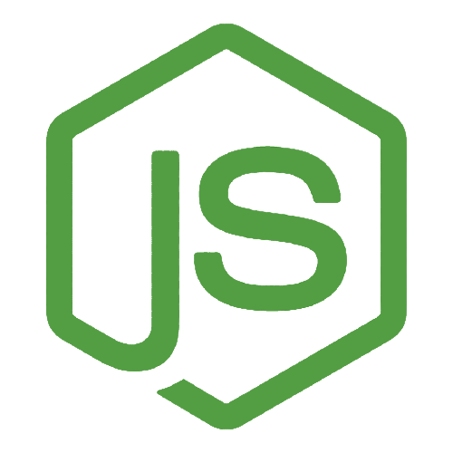

<h1 align="center">
    Hello My name is Felipe!
</h1>

---

Hello! my name is Felipe and I'm a Jr. Front-End developer!
 
✏️ I'm currently studyng System Analysis and Development
 
🛠️ Searching for my first job in the technology Area

<h4>Main Abilities:</h4>

<h4>Currently Learning:</h4>

<h4>Interested Into: </h4>

---

<i>My dream is to change the world through technology and acessibility</i>

---

<!--
**felipeselau/felipeselau** is a ✨ _special_ ✨ repository because its `README.md` (this file) appears on your GitHub profile.

Here are some ideas to get you started:

- 🔭 I’m currently working on ...
- 🌱 I’m currently learning ...
- 👯 I’m looking to collaborate on ...
- 🤔 I’m looking for help with ...
- 💬 Ask me about ...
- 📫 How to reach me: ...
- 😄 Pronouns: ...
- ⚡ Fun fact: ...
-->
